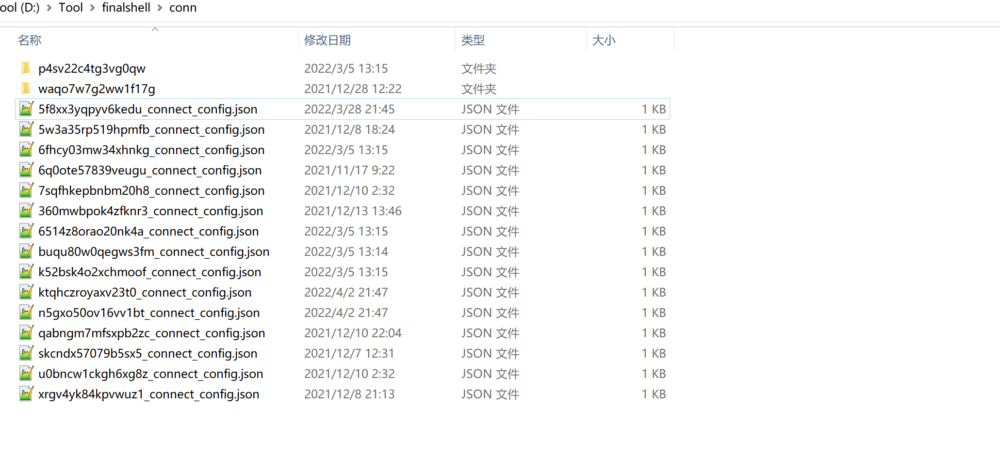

# FinalShell-Decoder

> FinallShell 密码解密GUI工具

解密部分参考https://github.com/jas502n/FinalShellDecodePass ，做了图形化显示：

	

可在文本框中直接输入路径或点击选择按钮选择FinalShell配置文件根路径，一般在 `%FINALSHELL_INSTALL_PATH%/conn` 目录下：

也可将远程主机文件下载到本地解密，输入合法路径后自动生成所有主机配置信息：

	

双击单元格可复制所选信息。